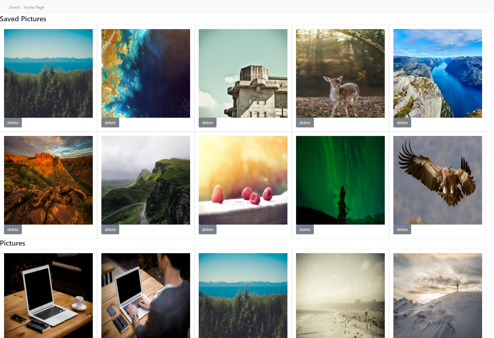

# REACT Routing App

##  Description of the project:
Got list of random pictures from picsum photos API. Feature that included is we can save favorite pictures. Provided delete option as well. Used REACT routing library to sync different components with in the navbar.

##  Roadmap of future improvements:
Need to enhance the use of routing, so we can show saved images in the saved page.

###  Contact details: gv68682@gmail.com
